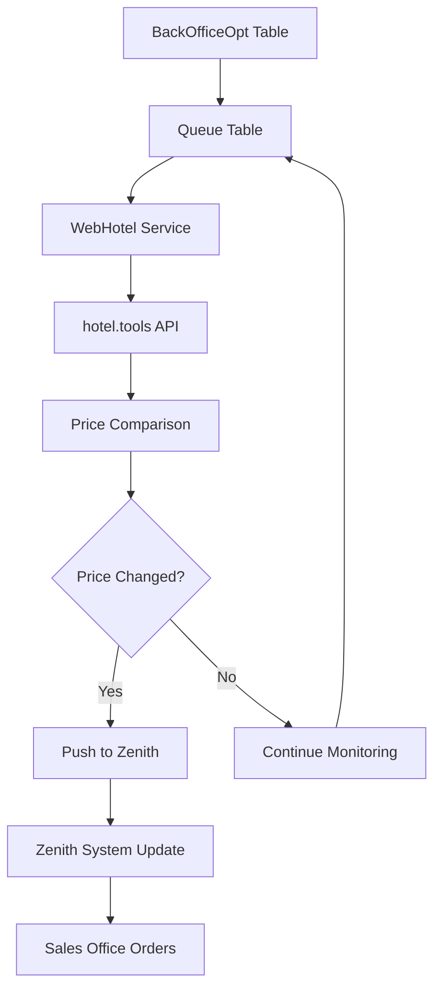
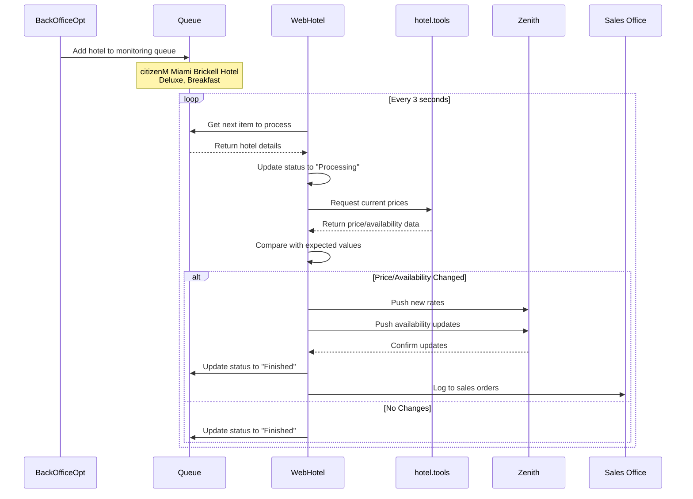

# 🏨 מערכת בדיקת מחירי מלונות ועדכון זניט - תיעוד מקיף
Generated: 23/02/2026 12:30:00

## 📋 תמצית מנהלים

מערכת אוטומטית מתקדמת לניטור מחירי מלונות בזמן אמת ועדכון מערכת זניט. המערכת בודקת באופן תקופתי 4 מלונות (כולל citizenM Miami Brickell Hotel), משווה מחירים, ומעדכנת את מערכת זניט בהתאם לשינויים.

## 🎯 מטרת המערכת

### יעדים עסקיים:
- **ניטור מחירים אוטומטי**: בדיקה תקופתית של מחירי מלונות
- **עדכון זניט**: סנכרון מחירים ממערכת hotel.tools למערכת זניט  
- **מעקב זמינות**: ניטור מספר חדרים זמינים
- **התרעות בזמן אמת**: הודעות על שינויים במחירים
- **דיווח מקיף**: מעקב אחר כל הפעילות במערכת Sales Office

## 🏗️ ארכיטקטורה כללית



## 🗃️ מבנה הטבלאות

### 📊 **1. BackOfficeOpt** - טבלת הזדמנויות עסקיות
```sql
CREATE TABLE BackOfficeOpt (
    Id INT PRIMARY KEY IDENTITY,
    DateInsert DATETIME NOT NULL,
    CountryId INT,
    HotelId INT,                    -- קוד המלון למעקב
    StartDate DATETIME,             -- תאריך התחלה לבדיקה
    EndDate DATETIME,               -- תאריך סיום לבדיקה
    BordId INT,                     -- סוג האוכל (Breakfast, etc.)
    CatrgoryId INT,                 -- קטגוריית חדר (Deluxe, etc.)
    BuyPrice FLOAT,                 -- מחיר רכישה
    PushPrice FLOAT,                -- מחיר לדחיפה לזניט
    MaxRooms INT,                   -- מספר חדרים מקסימלי
    Status BIT,                     -- סטטוס פעיל/לא פעיל
    InvTypeCode NVARCHAR(50),       -- קוד סוג מלאי
    RatePlanCode NVARCHAR(50),      -- קוד תוכנית תעריפים
    ReservationFirstName NVARCHAR(50) -- שם פרטי להזמנה
);
```

**מלונות נוכחיים במערכת:**
- citizenM Miami Brickell Hotel
- 3 מלונות נוספים

### 🔄 **2. Queue** - תור העיבוד
```sql
CREATE TABLE Queue (
    Id INT PRIMARY KEY IDENTITY,
    CreatedOn DATETIME NOT NULL,
    PrebookId INT,                  -- מזהה הזמנה מקדימה
    Status NVARCHAR(50) NOT NULL,   -- AddedToQueue/Processing/Finished/Error
    Message NVARCHAR(MAX),          -- הודעת סטטוס
    HotelId INT,                    -- קוד המלון בזניט
    HotelName NVARCHAR(250),        -- שם המלון (citizenM Miami Brickell Hotel)
    Month INT,                      -- חודש לבדיקה
    Year INT,                       -- שנה לבדיקה
    Day INT,                        -- יום לבדיקה
    ReservationsExpected INT,       -- מספר הזמנות צפוי
    PriceExpected DECIMAL(18,2),    -- מחיר צפוי
    Pricing NVARCHAR(100),          -- קטגוריה (Deluxe, Standard)
    RatePlan NVARCHAR(100),         -- תוכנית תעריפים (Breakfast, BB)
    Parameters NVARCHAR(MAX)        -- פרמטרים נוספים (JSON)
);
```

**סטטוסי תור:**
- `AddedToQueue`: נוסף לתור המתנה
- `Processing`: בעיבוד כרגע  
- `Finished`: הושלם בהצלחה
- `Error`: שגיאה בעיבוד

### 📈 **3. SalesOrderBackOffice** - דיווח מכירות
```sql
CREATE TABLE SalesOrderBackOffice (
    Id INT PRIMARY KEY,
    SoldId INT,
    BoardId INT,
    CategoryId INT,
    HotelId INT,
    ZenithId INT,                   -- מזהה בזניט
    PreBookId INT,
    ContentBookingId INT,
    DateInsert DATETIME,
    StartDate DATETIME,
    EndDate DATETIME,
    Name NVARCHAR(250),             -- שם המלון
    Price FLOAT,
    PushPrice FLOAT,                -- המחיר שנדחף לזניט
    Board NVARCHAR(100),
    IsActive BIT,
    IsSold BIT,
    Category NVARCHAR(100),
    CancellationTo DATETIME,
    NameUpdate BIT,
    StatusChangeName INT,
    Provider NVARCHAR(100),
    RefAgency NVARCHAR(100),
    RefEmail NVARCHAR(150),
    ReservationFullName NVARCHAR(250),
    SupplierReference NVARCHAR(50)
);
```

### 🏨 **4. PushRoom** - מידע לדחיפה לזניט
```sql
CREATE TABLE PushRoom (
    HotelsToPushId INT,
    BookId INT,
    OpportunityId INT,
    DateForm DATETIME,
    DateTo DATETIME,
    PaxAdultsCount INT,
    PaxChildrenCount INT,
    PushHotelCode INT,              -- קוד המלון בזניט
    PushBookingLimit INT,
    PushInvTypeCode NVARCHAR(50),   -- קוד סוג מלאי לזניט
    PushRatePlanCode NVARCHAR(50),  -- קוד תועריף לזניט
    PushPrice FLOAT,                -- המחיר לדחיפה
    PushCurrency NVARCHAR(10),      -- מטבע (USD)
    Innstant_ZenithId INT,          -- מזהה זניט
    HotelName NVARCHAR(250),        -- שם המלון
    HotelId INT,
    Board NVARCHAR(100),
    BoardId INT,
    Category NVARCHAR(100),
    CategoryId INT
);
```

## ⚙️ רכיבי המערכת

### 🤖 **1. WebHotel Service** - השירות הראשי

**מיקום**: `WebHotel/Program.cs`

**תפקיד**: שירות רקע הפועל 24/7 ובודק מחירים מהתור

```csharp
// התהליך הראשי
while (true) {
    // 1. קבלת פריט הבא מהתור
    var nextItem = await Common.GetNextItem();
    
    if (nextItem != null) {
        // 2. הכנת בקשה למלון
        var search = new HotelToolsSearchRequest(
            nextItem.HotelName,     // "citizenM Miami Brickell Hotel"
            nextItem.Pricing,       // "Deluxe"
            nextItem.RatePlan,      // "Breakfast" 
            new DateTime(year, month, 1)
        );
        
        // 3. עדכון סטטוס - Processing
        nextItem.Status = QueueCheckStatus.Processing.ToString();
        await Common.UpdateQueueItem(nextItem);
        
        // 4. בדיקת מחירים מ-hotel.tools
        (var data, var error) = WebDriverProccessing.ProcessRequest(search);
        
        // 5. עיבוד התוצאות
        if (data != null) {
            await Common.ProcessResult(nextItem, data, snapParams);
        }
    }
    
    // המתנה 3 שניות בין בדיקות
    Task.Delay(TimeSpan.FromSeconds(3)).Wait();
}
```

**קבצי קונפיגורציה**: `WebHotel/appsettings.json`
```json
{
  "AccountName": "medici_account",
  "AgentName": "medici_agent", 
  "Password": "****",
  "BaseUrl": "https://hotel.tools/",
  "NotificationsBaseUrl": "http://medici-notifications/",
  "PathToCachedData": "C:/temp/cached/"
}
```

### 🌐 **2. Hotel.tools Integration**

**מיקום**: `WebHotelLib/WebDriverProccessing.cs`

**תפקיד**: חיבור למערכת hotel.tools לקבלת מחירים

```csharp
public static (List<CellData>, string) ProcessRequest(HotelToolsSearchRequest searchRequest) {
    // קבלת HTML מאתר hotel.tools
    (var html, error) = GetHtml(searchRequest);
    
    if (html != string.Empty) {
        // פענוח הטבלה
        var items = ParseTable(html, searchRequest.MonthYear);
        return (items, error);
    }
    return (null, error);
}
```

**חיבור למערכת**:
```csharp
public static string hoteltools_url = "https://hotel.tools/service/Medici%20new";
public static string Username = "APIMedici:Medici Live";  
public static string Password = "12345";
```

### 🔍 **3. השוואת מחירים**

**מיקום**: `WebHotel/Common.cs`

```csharp
internal static async Task<bool> ProcessResult(Queue itemToProcess, List<CellData> results, SnapshotCheckParameters snapParams) {
    
    var afterCheck = results.FirstOrDefault(i => 
        i.Date.Year == itemToProcess.Year && 
        i.Date.Month == itemToProcess.Month && 
        i.Date.Day == itemToProcess.Day
    );
    
    if (afterCheck != null) {
        decimal price1 = SharedLibrary.Common.GetValueTruncated((decimal)itemToProcess.PriceExpected);
        decimal price2 = SharedLibrary.Common.GetValueTruncated(afterCheck.Price);
        
        if (price1 == price2 && itemToProcess.ReservationsExpected == afterCheck.Reserved) {
            msg = "Snapshot check SUCCESS";
        } else {
            msg = $"Snapshot check error. Before check price: {itemToProcess.PriceExpected} reserved: {itemToProcess.ReservationsExpected} After check price: {afterCheck.Price} reserved: {afterCheck.Reserved}";
        }
    }
    
    // עדכון התוצאה ושליחת התרעה
    itemToProcess.Message = msg;
    itemToProcess.Status = QueueCheckStatus.Finished.ToString();
    
    if (snapParams.SendNotification) {
        await PublishNotification(msg);
    }
}
```

### ⚡ **4. עדכון מערכת זניט**

**מיקום**: `EFModel/BaseEF.cs`

#### **עדכון מחירים** - PushRates:
```csharp
public async Task<(bool, string)> PushRates(PushRoom room) {
    
    PushRatesRequest pushRatesRequest = new PushRatesRequest() {
        Start = room.DateForm.ToString("yyyy-MM-dd"),
        End = room.DateForm.ToString("yyyy-MM-dd"),  
        HotelCode = room.Innstant_ZenithId.ToString(),    // קוד זניט
        InvTypeCode = room.PushInvTypeCode,               // "STD"
        RatePlanCodeor = room.PushRatePlanCode,           // קוד תעריף
        AmountAfterTax = room.PushPrice.ToString()        // המחיר החדש!
    };
    
    // שליחה לזניט
    var pushRatesRes = await ApiInstantZenith.PushRates(pushRatesRequest);
    
    if (pushRatesRes.envelope != null && pushRatesRes.envelope.Body.OTA_HotelRateAmountNotifRS.ErrorsNotif == null) {
        return (true, "Success");
    } else {
        return (false, "Error updating Zenith");
    }
}
```

#### **עדכון זמינות** - PushAvailabilityAndRestrictions:
```csharp
public async Task<(bool, string)> PushAvailabilityAndRestrictions(PushRoom room, int availableRooms) {
    
    PushAvailabilityAndRestrictionsResRequest request = new PushAvailabilityAndRestrictionsResRequest() {
        HotelCode = room.Innstant_ZenithId.ToString(),
        BookingLimit = availableRooms.ToString(),         // מספר חדרים זמינים
        InvTypeCode = room.PushInvTypeCode,
        RatePlanCodeor = room.PushRatePlanCode,
        Start = room.DateForm.ToString("yyyy-MM-dd"),
        End = room.DateTo.ToString("yyyy-MM-dd"),
        Status = "Open"                                   // פתוח להזמנות
    };
    
    var response = await ApiInstantZenith.AvailabilityAndRestrictions(request);
    // בדיקת התוצאה והחזרת סטטוס
}
```

### 📊 **5. ZenithApiController** - קבלת הזמנות מזניט

**מיקום**: `Backend/Controllers/ZenithApiController.cs`

```csharp
[HttpPost("ZenithApi/reservation")]
[AllowAnonymous] 
public async Task<XmlActionResult> reservation() {
    
    try {
        // קריאת XML מבקשת הזמנה מזניט
        string requestBody = await ReadRequestBody();
        
        // פענוח בקשת ההזמנה
        var reservationRequest = ParseReservationRequest(requestBody);
        
        // עיבוד ההזמנה
        var reservationId = await ProcessReservation(reservationRequest);
        
        // החזרת תגובה חיובית לזניט
        return new XmlActionResult(CreateSuccessResponse(reservationId));
        
    } catch (Exception ex) {
        // החזרת שגיאה לזניט
        return new XmlActionResult(CreateErrorResponse(ex.Message));
    }
}
```

## 🔄 זרימת התהליכים

### 🚀 **תהליך ראשי - ניטור מחירים**



### 📋 **תהליך עדכון מחיר ספציפי**

1. **זיהוי שינוי**: WebHotel מזהה הבדל במחיר/זמינות
2. **הכנת בקשה**: יצירת `PushRatesRequest` עם הנתונים החדשים
3. **שליחה לזניט**: קריאה ל-`ApiInstantZenith.PushRates()`
4. **בדיקת תגובה**: וילדציה שהעדכון התקבל בזניט
5. **עדכון מסד נתונים**: עדכון הטבלאות המקומיות
6. **דיווח**: רישום בסטטיסטיקות ו-Sales Office

### 🎯 **תהליך קבלת הזמנות מזניט**

1. **קבלת XML**: זניט שולח בקשת הזמנה ב-XML
2. **פענוח בקשה**: המרה ל-objects של .NET
3. **ולידציה**: בדיקת זמינות ותקינות הנתונים
4. **עיבוד הזמנה**: רישום במסד הנתונים
5. **תגובה**: החזרת XML עם מזהה הזמנה או שגיאה

## 🔧 קבצי תצורה ותלויות

### **appsettings.json** - WebHotel
```json
{
  "AccountName": "medici_account",
  "AgentName": "medici_agent",
  "Password": "[PASSWORD]",
  "BaseUrl": "https://hotel.tools/",
  "NotificationsBaseUrl": "http://medici-notifications-api/",
  "PathToCachedData": "C:/temp/hotel-data-cache/"
}
```

### **תלויות NuGet עיקריות:**
- `Microsoft.EntityFrameworkCore` - ORM
- `RestSharp` - HTTP requests
- `Newtonsoft.Json` - JSON serialization
- `System.Xml.Serialization` - XML handling
- `Microsoft.Extensions.Configuration` - Configuration

## 🎭 מודלים ו-DTOs

### **HotelToolsSearchRequest**
```csharp
public class HotelToolsSearchRequest {
    public string HotelName { get; set; }     // "citizenM Miami Brickell Hotel"
    public string Category { get; set; }      // "Deluxe"
    public string Board { get; set; }         // "Breakfast"  
    public DateTime MonthYear { get; set; }   // חודש לבדיקה
}
```

### **CellData** - תוצאות מ-hotel.tools
```csharp
public class CellData {
    public DateTime Date { get; set; }        // תאריך
    public decimal Price { get; set; }        // מחיר
    public int Reserved { get; set; }         // חדרים שמורים
}
```

### **PushRatesRequest** - עדכון זניט
```csharp
public class PushRatesRequest {
    public string HotelCode { get; set; }     // קוד המלון בזניט
    public string InvTypeCode { get; set; }   // "STD"
    public string RatePlanCodeor { get; set; } // קוד תעריף
    public string Start { get; set; }         // תאריך התחלה
    public string End { get; set; }           // תאריך סיום
    public string AmountAfterTax { get; set; } // מחיר חדש
}
```

## 🚨 ניטור ושגיאות

### **רשימת שגיאות נפוצות:**

1. **Hotel tools timeout**: `"No such host is known"`
2. **Zenith API error**: `"Cannot update rates in Zenith"`  
3. **Queue processing error**: `"The Request did not return results"`
4. **Price comparison error**: `"Snapshot check error"`

### **מנגנון התרעות:**

#### **Slack Integration**:
```csharp
await Repository.Instance.PublishToSlack($"Item added to queue Update PushPrice. PreBookId:{bookId}");
```

#### **Email Notifications**:
```csharp
await SendEmailNotificationToDefaultRecipients("Price Alert", $"Price changed for hotel: {hotelName}");
```

### **Logging**:
- `SystemLog.cs` - לוגים מרכזיים
- Extension method `.Log()` על strings
- רישום לטבלת `BackOfficeOptLog`

## 📈 מדדים ומעקב

### **KPIs עיקריים:**
- **זמן תגובה ממוצע**: מהתור לעדכון זניט
- **שיעור הצלחה**: אחוז עדכונים מוצלחים
- **מספר מלונות פעילים**: 4 מלונות כרגע  
- **תדירות בדיקות**: כל 3 שניות
- **נפח שינויי מחירים**: מעקב יומי/שבועי

### **דיווחים במערכת Sales Office:**
- מעקב אחר כל ההזמנות
- סטטוס "Completed; Innstant Api Rooms..."
- פיילוח לפי מלון, תאריך, קטגוריה
- מחירי buy vs push

## 🔒 אבטחה

### **אימות API**:
- Username/Password לחיבור ל-hotel.tools
- XML Signature לתקשורת עם זניט
- Basic Authentication למערכת הפנימית

### **הצפנת נתונים**:
- Connection strings מוצפנים
- Passwords בקונפיגורציה מוגנת
- HTTPS לכל התקשורת החיצונית

## 🛠️ תחזוקה ותמיכה

### **ביצועים:**
- שמירה ב-cache לנתונים שנבדקו
- Connection pooling למסד הנתונים
- Async/await לכל הפעולות

### **גיבוי והתאוששות:**
- גיבוי יומי לטבלאות Queue ו-BackOfficeOpt
- שמירת logs למשך 90 יום
- מנגנון retry ל-API calls שנכשלו

### **פריסה:**
- WebHotel פועל כ-Windows Service
- ZenithApiController חלק מה-Backend API
- מסד נתונים SQL Server עם HA

## 🏆 סיכום

מערכת מתקדמת ויציבה לניטור מחירי מלונות ועדכון אוטומטי של זניט. המערכת פועלת 24/7, מטפלת ב-4 מלונות כולל citizenM Miami Brickell Hotel, ומבטיחה סנכרון מדויק של מחירים וזמינות בין hotel.tools למערכת זניט.

**טכנולוגיות עיקריות:** .NET 6, Entity Framework, SQL Server, RestSharp, XML Processing
**זמן פיתוח:** מערכת בייצור פעילה
**צוות תחזוקה:** מפתחי Medici Hotels

---
*תיעוד זה עודכן לאחרונה: 23/02/2026*
*גרסת מערכת: Production v2.1*